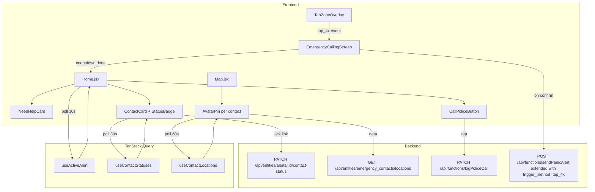

# Design Document — Emergency SOS Enhancements

## Overview

This document describes the technical design for six SOS-capability enhancements to the Panic Ring safety app. Each enhancement is self-contained but they are designed to compose naturally: the Tap-4x trigger feeds the Emergency Calling Screen, the Calling Screen transitions to the home screen which renders the Need Help Card and the Call Police button, the Contacts page gains status badges, and the Map view gains contact avatar pins.

The app stack is:
- **Frontend**: React 18 + Vite, TanStack Query, Framer Motion, Leaflet/react-leaflet, Tailwind CSS, react-router-dom v6
- **Backend**: Node.js + Express, better-sqlite3 (WAL mode), JWT auth via `authMiddleware`
- **Client API**: `phumeClient.js` — `auth`, `entities` (factory), `functions.invoke`

All new backend endpoints follow the existing security model: `owner_email` is always derived from the JWT, never trusted from the request body.

---

## Architecture

The six features map to three architectural layers:



**State ownership**:
- `activeAlert` — owned by `Home.jsx` via TanStack Query `['alerts', user.email]` (already exists, `refetchInterval: 30000`)
- `contactStatuses` — new query `['contactStatuses', activeAlert?.id]`
- `contactLocations` — new query `['contactLocations', user.email]`
- `tapCooldown` — `useRef` / `useState` local to `TapZoneOverlay`
- `callingScreenVisible` — `useState` in `Home.jsx`, lifted because it blocks the whole page

---

## Components and Interfaces

### 1. `TapZoneOverlay` (`src/components/home/TapZoneOverlay.jsx`)

Renders an invisible `<div>` fixed to the bottom-right of the viewport. Collects touch/click events and detects the 4-tap pattern.

**Props:**
```ts
interface TapZoneOverlayProps {
  enabled: boolean;            // from settings: tap_trigger_enabled
  onTrigger: () => void;       // called when 4 taps in 2s detected
}
```

**Internal state:**
- `tapTimestamps: number[]` — rolling array of the last 4 tap times
- `cooldownUntil: number` — epoch ms; taps ignored if `Date.now() < cooldownUntil`

**Detection logic (pure, exported for testing):**
```js
// Returns true if the last 4 timestamps in `taps` all fall within a 2000ms window
export function isTap4xSequence(taps /*: number[]*/) {
  if (taps.length < 4) return false;
  const last4 = taps.slice(-4);
  return last4[3] - last4[0] <= 2000;
}
```

**CSS:** `position: fixed; bottom: 0; right: 0; width: 64px; height: 64px; z-index: 9998; opacity: 0; pointer-events: auto;`

**Cooldown:** after a trigger, `cooldownUntil = Date.now() + 15_000`. New taps that arrive while `Date.now() < cooldownUntil` increment the array but `onTrigger` is not fired.

---

### 2. `EmergencyCallingScreen` (`src/components/home/EmergencyCallingScreen.jsx`)

Full-screen fixed overlay. Rendered by `Home.jsx` when `callingScreenVisible === true`.

**Props:**
```ts
interface EmergencyCallingScreenProps {
  contacts: Contact[];
  onConfirm: () => void;    // countdown finished — send alert
  onCancel: () => void;     // user pressed Cancel
}
```

**Internal state:**
- `seconds: number` — starts at 5, decremented each second by `setInterval`; cleared on unmount
- `phase: 'countdown' | 'calling'` — switches when `seconds` reaches 0

**Timer resilience:** On mount, record `startTime = Date.now()`. In the interval callback, compute `elapsed = Math.floor((Date.now() - startTime) / 1000)` and set `seconds = Math.max(0, 5 - elapsed)`. This correctly handles `setInterval` drift and background throttling without needing a Web Worker.

**Avatar rings:** `contacts.map(c => <ContactRing key={c.id} contact={c} />)` — each ring is an absolutely-positioned `div` with Framer Motion `animate={{ scale: [1, 1.8], opacity: [0.8, 0] }}` pulsing ring.

**Cancel:** calls `onCancel()`, which sets `callingScreenVisible = false` and does NOT call `sendPanicAlert`.

**Blocking overlay:** `position: fixed; inset: 0; z-index: 9999; pointer-events: all;` — prevents all interactions with underlying UI.

**Rendering logic in `Home.jsx`:**
```jsx
{callingScreenVisible && (
  <EmergencyCallingScreen
    contacts={contacts}
    onConfirm={handleCallingConfirm}
    onCancel={() => setCallingScreenVisible(false)}
  />
)}
```

`handleCallingConfirm` calls `functions.invoke('sendPanicAlert', { ..., trigger_method: 'tap_4x' })` then sets `callingScreenVisible = false` and invalidates the alerts query.

---

### 3. `StatusBadge` (`src/components/contacts/StatusBadge.jsx`)

A small pill rendered inside `ContactCard` when an alert is active.

**Props:**
```ts
interface StatusBadgeProps {
  status: 'safe' | 'alert' | null;
}
```

Renders `null` when `status === null` (no active alert). Green pill for `'safe'`, red pill for `'alert'`.

**`ContactCard` changes:** Accept new `alertStatus` prop (`'safe' | 'alert' | null`). Render `<StatusBadge status={alertStatus} />` adjacent to the contact name.

---

### 4. `CallPoliceButton` (`src/components/home/CallPoliceButton.jsx`)

Reusable button used in both `Home.jsx` and `NeedHelpCard`.

**Props:**
```ts
interface CallPoliceButtonProps {
  emergencyNumber: string;    // default '10111'
  alertId?: string;           // if provided, log the call attempt
  className?: string;
}
```

**On tap:**
1. `window.location.href = 'tel:' + emergencyNumber`
2. If `alertId` is present, fire `PATCH /api/entities/Alert/<alertId>` with `call_attempt_at: new Date().toISOString()`
3. If telephony is not available (detected via `typeof window.location.href` not being supported, or caught navigation error), display an inline fallback `<p>` showing the number

**Telephony detection:** Wrap in `<a href={'tel:' + emergencyNumber}>` — on desktop browsers this opens a dial-pad app if one is associated; if not, the browser simply does nothing. A more reliable UX fallback can be to render both the `<a>` link and a visible number text simultaneously on non-mobile (detected via `window.navigator.userAgent`).

---

### 5. `NeedHelpCard` (`src/components/home/NeedHelpCard.jsx`)

Rendered on `Home.jsx` below `ActiveAlertBanner` when an alert is active.

**Props:**
```ts
interface NeedHelpCardProps {
  alert: Alert;
  profile: SafetyProfile;
  emergencyNumber: string;
}
```

**Address display logic:**
```js
function displayLocation(alert) {
  if (alert.address) return alert.address;
  if (alert.latitude != null && alert.longitude != null) {
    return `${alert.latitude.toFixed(5)}°, ${alert.longitude.toFixed(5)}°`;
  }
  return 'Location unavailable';
}
```

**Timestamp format:** Uses `date-fns` (already a dependency):
```js
import { formatInTimeZone } from 'date-fns-tz'; // note: date-fns-tz is NOT in package.json — use Intl.DateTimeFormat instead
```
Since `date-fns-tz` is not installed, use `Intl.DateTimeFormat`:
```js
function formatAlertTime(isoString) {
  const date = new Date(isoString);
  const tz = 'Africa/Johannesburg';
  const time = new Intl.DateTimeFormat('en-ZA', {
    hour: '2-digit', minute: '2-digit', hour12: false, timeZone: tz,
  }).format(date);
  const datePart = new Intl.DateTimeFormat('en-ZA', {
    day: '2-digit', month: 'short', year: 'numeric', timeZone: tz,
  }).format(date);
  return `${time} · ${datePart}`;
}
```

**Layout constraint (Req 6.8):** `NeedHelpCard` must fit within 600px viewport. It uses a compact single-card layout with no collapsible sections. On `Home.jsx` it is placed immediately after `ActiveAlertBanner` so it appears at the top of the scroll area.

---

### 6. `AvatarPin` — Contact Map Layer (`src/pages/Map.jsx` additions)

New Leaflet `DivIcon`-based markers for contact locations.

**`createAvatarIcon(contact)` utility:**
```js
function getInitials(name) {
  return name.trim().split(/\s+/).map(w => w[0].toUpperCase()).slice(0, 2).join('');
}

function getRelationshipColor(relationship) {
  const map = {
    family: '#f43f5e', friend: '#3b82f6', colleague: '#a855f7',
    neighbor: '#f59e0b', other: '#6b7280',
  };
  return map[relationship] || map.other;
}

function createAvatarIcon(contact, isStale) {
  const initials = getInitials(contact.name);
  const color = getRelationshipColor(contact.relationship);
  const opacity = isStale ? 0.4 : 1.0;
  return L.divIcon({
    className: '',
    html: `<div style="width:36px;height:36px;border-radius:50%;background:${color};
                       display:flex;align-items:center;justify-content:center;
                       color:#fff;font-weight:bold;font-size:12px;
                       opacity:${opacity};border:2px solid #fff;box-shadow:0 2px 6px rgba(0,0,0,.4)">
             ${initials}
           </div>`,
    iconSize: [36, 36],
    iconAnchor: [18, 18],
  });
}
```

**Staleness:** A contact location is stale if `Date.now() - new Date(last_location_update).getTime() > 60 * 60 * 1000`.

**Popup content:**
```jsx
<Popup>
  <strong>{contact.name}</strong><br />
  {contact.relationship}<br />
  Last seen: {formatRelativeTime(contact.last_location_update)}
</Popup>
```

**Integration in `Map.jsx`:** New `useQuery` for contact locations, polling every 60s while map is mounted. Renders `<Marker>` for each contact with a known location, using `createAvatarIcon`.

---

## Data Models

### Backend schema migrations

Add the following columns/tables via the existing migration array in `database.js`:

```sql
-- Req 3: Contact acknowledgement status per alert
ALTER TABLE alerts ADD COLUMN contact_statuses TEXT DEFAULT '{}';
-- Stores JSON: { "27821234567": "safe", "27831234567": "alert" }

-- Req 4: Call Police log per alert
ALTER TABLE alerts ADD COLUMN call_attempt_at TEXT DEFAULT NULL;

-- Req 1: Tap trigger setting per user
ALTER TABLE safety_profiles ADD COLUMN tap_trigger_enabled INTEGER DEFAULT 1;

-- Req 4: Configurable emergency number per user
ALTER TABLE safety_profiles ADD COLUMN emergency_number TEXT DEFAULT '10111';

-- Req 5: Contact location opt-in and last known location
ALTER TABLE emergency_contacts ADD COLUMN location_sharing_enabled INTEGER DEFAULT 0;
ALTER TABLE emergency_contacts ADD COLUMN last_latitude REAL DEFAULT NULL;
ALTER TABLE emergency_contacts ADD COLUMN last_longitude REAL DEFAULT NULL;
ALTER TABLE emergency_contacts ADD COLUMN last_location_update TEXT DEFAULT NULL;
```

All migrations are guarded with try/catch to ignore `duplicate column` errors (matching the existing pattern).

### Updated entity shapes

**Alert** (additions):
```json
{
  "contact_statuses": "{}",
  "call_attempt_at": null
}
```

`contact_statuses` is a JSON string mapping `contact_phone → 'safe' | 'alert'`. Serialization uses `JSON.stringify`/`JSON.parse` in `deserializeRow` (matching the existing `contacts_notified` pattern).

**SafetyProfile** (additions):
```json
{
  "tap_trigger_enabled": true,
  "emergency_number": "10111"
}
```

**EmergencyContact** (additions):
```json
{
  "location_sharing_enabled": false,
  "last_latitude": null,
  "last_longitude": null,
  "last_location_update": null
}
```

### New API endpoints

#### `PATCH /api/entities/alerts/:id/contact-status`

Added to `backend/src/routes/entities.js` as a sub-resource route (before the generic `/:entity/:id` PATCH):

```
PATCH /api/entities/alerts/:id/contact-status
Authorization: Bearer <token>
Body: { "contact_phone": "27821234567", "status": "safe" | "alert" }
Response: { "success": true, "contact_statuses": { ... } }
```

Implementation reads the alert, parses `contact_statuses`, merges the update, serializes back, and writes via `db.update`. Enforces `owner_email === req.user.email`.

#### `GET /api/entities/emergency_contacts/locations`

Added as a dedicated route in `entities.js` (before the generic `/:entity` routes):

```
GET /api/entities/emergency_contacts/locations
Authorization: Bearer <token>
Response: [{ id, name, relationship, last_latitude, last_longitude, last_location_update }, ...]
```

Returns only contacts where `owner_email = req.user.email AND location_sharing_enabled = 1 AND last_latitude IS NOT NULL`.

---

## Correctness Properties

*A property is a characteristic or behavior that should hold true across all valid executions of a system — essentially, a formal statement about what the system should do. Properties serve as the bridge between human-readable specifications and machine-verifiable correctness guarantees.*

### Property 1: Tap-4x detection is timing-exact

*For any* sequence of tap timestamps, `isTap4xSequence` returns `true` if and only if the sequence contains at least 4 taps and the earliest and latest of the last 4 timestamps differ by no more than 2000 ms.

**Validates: Requirements 1.2**

---

### Property 2: Tap cooldown suppresses duplicate triggers

*For any* trigger fire time T and any subsequent tap-sequence time S, if `S - T < 15000` then the trigger is suppressed; if `S - T >= 15000` then the trigger is allowed.

**Validates: Requirements 1.4**

---

### Property 3: tap_4x trigger is recorded in the alert

*For any* alert created via the tap_4x path, reading the alert record back from the API must yield `trigger_method === 'tap_4x'`.

**Validates: Requirements 1.6**

---

### Property 4: Countdown display is monotonically correct

*For any* elapsed time T (in whole seconds, 0 ≤ T ≤ 5), the countdown display shows `max(0, 5 - T)`, and for T ≥ 5 the overlay shows "Emergency Calling…" text instead of a number.

**Validates: Requirements 2.2, 2.3**

---

### Property 5: Avatar rings match contact count

*For any* list of N contacts passed to `EmergencyCallingScreen`, exactly N avatar ring elements are rendered.

**Validates: Requirements 2.4**

---

### Property 6: Status badges reflect contact_statuses map

*For any* map of contact phone → status (`'safe' | 'alert'`), and *for any* contact in the list, the badge rendered on that contact's `ContactCard` must match the status value in the map (or be absent when no alert is active).

**Validates: Requirements 3.1, 3.5, 3.7**

---

### Property 7: contact_statuses round-trips through the backend

*For any* arbitrary map of `contact_phone → 'safe' | 'alert'` entries, calling `PATCH /api/entities/alerts/:id/contact-status` for each entry and then reading the alert back must yield a `contact_statuses` JSON field that exactly preserves the map.

**Validates: Requirements 3.2, 3.6**

---

### Property 8: Contact-status polling interval never exceeds 30 s

*For any* sequence of polling events while an alert is active, the time gap between any two consecutive fetches of contact-status data must be ≤ 30 000 ms.

**Validates: Requirements 3.4**

---

### Property 9: Call Police href is always tel:<emergencyNumber>

*For any* non-empty emergency number string `n`, tapping the Call Police button produces `window.location.href = 'tel:' + n` with no transformation applied to `n`.

**Validates: Requirements 4.2**

---

### Property 10: Emergency number round-trips through Settings

*For any* valid emergency number string saved in the Settings page, reading the safety profile back from the API must return the same string in `emergency_number`.

**Validates: Requirements 4.5**

---

### Property 11: Call attempt timestamp is logged on tap

*For any* active alert, tapping Call Police must result in the alert record having a non-null `call_attempt_at` field that is a valid ISO 8601 timestamp.

**Validates: Requirements 4.4**

---

### Property 12: Avatar pins match contacts-with-location count

*For any* list of contacts where some have `last_latitude/last_longitude` and some do not, the map renders exactly one `AvatarPin` per contact that has both coordinates, and zero pins for contacts without coordinates.

**Validates: Requirements 5.1, 5.7**

---

### Property 13: Stale location pins render at 0.4 opacity

*For any* contact location timestamp, if the age exceeds 60 minutes the avatar pin's opacity is 0.4; otherwise it is 1.0.

**Validates: Requirements 5.3**

---

### Property 14: Avatar pin initials match contact name

*For any* contact name string, the initials displayed in the pin equal the first uppercase character of each whitespace-delimited word, truncated to 2 characters.

**Validates: Requirements 5.4**

---

### Property 15: Contact location API returns only opted-in contacts

*For any* authenticated user with a mix of opted-in and opted-out contacts, `GET /api/entities/emergency_contacts/locations` returns only the subset where `location_sharing_enabled = 1` and coordinates are present.

**Validates: Requirements 5.2**

---

### Property 16: NeedHelpCard location display falls back correctly

*For any* alert record, the displayed location string is the `address` field if non-null/non-empty, otherwise the decimal-degree formatted coordinates (if available), otherwise "Location unavailable".

**Validates: Requirements 6.2**

---

### Property 17: NeedHelpCard timestamp format matches pattern

*For any* ISO timestamp, the formatted string produced by `formatAlertTime` matches the pattern `HH:mm · DD MMM YYYY` in the `Africa/Johannesburg` timezone.

**Validates: Requirements 6.3**

---

### Property 18: NeedHelpCard phone number round-trips from profile

*For any* phone number string stored in the safety profile's `owner_phone` field, the `NeedHelpCard` renders that exact string in its phone number section.

**Validates: Requirements 6.4**

---

## Error Handling

| Scenario | Handling |
|---|---|
| Geolocation denied when tap-4x fires | Alert is created with `latitude: null, longitude: null`; EmergencyCallingScreen still proceeds |
| `sendPanicAlert` network failure | Existing offline queue (`useOfflineMode`) handles queueing; EmergencyCallingScreen shows error state and re-enables Cancel |
| `PATCH contact-status` fails | TanStack Query retries 3× with exponential backoff; UI shows stale badge until next poll succeeds |
| `GET emergency_contacts/locations` fails | Map renders without contact pins; no error shown (silent degradation) |
| `PATCH call_attempt_at` fails | Call still proceeds (`tel:` href fires first); PATCH failure is logged to console only |
| `formatAlertTime` receives invalid date | Returns "Unknown time" string; does not throw |
| Contact name is empty string | `getInitials('')` returns `'?'`; pin still renders |
| `tap_trigger_enabled` not yet in profile | Defaults to `true` (opt-in by default) via `profile?.tap_trigger_enabled ?? true` |

---

## Testing Strategy

### Unit tests (example-based)

Use **Vitest** (project's inferred test runner — Vite ecosystem, already in devDependencies category).

Focus areas:
- `isTap4xSequence` — boundary cases: exactly 4 taps at 2000 ms apart, 3 taps, gaps > 2000 ms
- `formatAlertTime` — specific known timestamps against expected strings
- `displayLocation` — alert with address, without address but with coords, without both
- `getInitials` — single name, double name, name with middle initial
- `EmergencyCallingScreen` Cancel flow — verify `onCancel` called, `onConfirm` not called
- `CallPoliceButton` — default number `10111`, custom number
- `NeedHelpCard` — renders with active alert, does not render without

### Property-based tests

Use **fast-check** (npm install --save-dev fast-check).

Each property test must run ≥ 100 iterations. Tag format: `// Feature: emergency-sos-enhancements, Property N: <text>`

| Property | Generator | Assertion |
|---|---|---|
| P1: Tap-4x timing | `fc.array(fc.integer({ min: 0, max: 10000 }), { minLength: 0, maxLength: 10 })` (cumulative sums) | result matches reference implementation |
| P2: Cooldown suppression | `fc.integer({ min: 0, max: 30000 })` (offset from trigger) | offset < 15000 → suppressed; ≥ 15000 → allowed |
| P4: Countdown display | `fc.integer({ min: 0, max: 10 })` (elapsed seconds) | `max(0, 5 - elapsed)` matches rendered text |
| P5: Avatar ring count | `fc.array(fc.record({ id: fc.uuid(), name: fc.string() }), { minLength: 0, maxLength: 20 })` | rendered ring count === contacts.length |
| P6: Status badge rendering | `fc.array(fc.record({ phone: fc.string(), status: fc.constantFrom('safe','alert') }))` | each card badge matches map entry |
| P7: contact_statuses round-trip | `fc.dictionary(fc.string(), fc.constantFrom('safe','alert'))` | PATCH → GET preserves map |
| P9: tel: href | `fc.string({ minLength: 1 })` | href === `'tel:' + number` |
| P12: Pin count | `fc.array(fc.record({ lat: fc.option(fc.float()), lng: fc.option(fc.float()) }))` | pins === contacts with both coords |
| P13: Stale opacity | `fc.integer({ min: 0, max: 200 })` (minutes old) | opacity 0.4 if > 60 min, else 1.0 |
| P14: Initials | `fc.string({ minLength: 1 })` (word-delimited) | matches manual split logic |
| P16: Address fallback | `fc.record({ address: fc.option(fc.string()), lat: fc.option(fc.float()), lng: fc.option(fc.float()) })` | correct fallback chain |
| P17: Timestamp format | `fc.date()` | output matches `/^\d{2}:\d{2} · \d{2} [A-Z][a-z]{2} \d{4}$/` |

### Integration tests (backend)

Using **Supertest** + the Express app directly (no live server needed):

- `PATCH /api/entities/alerts/:id/contact-status` — valid update, invalid status value, wrong owner
- `GET /api/entities/emergency_contacts/locations` — only opted-in, only with coords, auth required
- `PATCH /api/entities/Alert/:id` with `call_attempt_at` — field persisted and valid ISO string

### Manual / smoke tests

- Tap Zone: physical device test with 4 taps on bottom-right corner
- Call Police: verify `tel:` link opens dialer on Android/iOS
- EmergencyCallingScreen: background tab switch, verify countdown resumes correctly
- Map contact pins: verify correct color-coded pins appear, stale pins are dimmed
